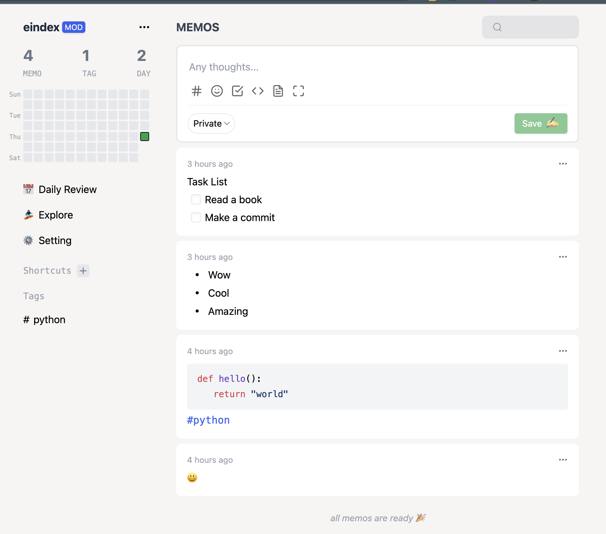
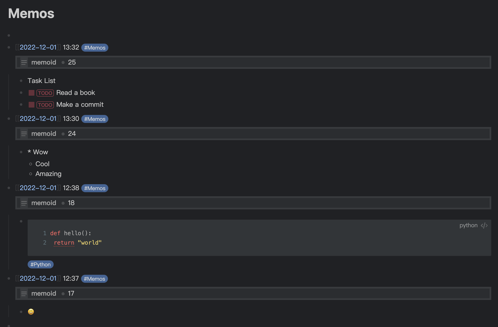

# logseq-memos-sync

> A memos sync plugin for logseq

## Features

- Sync memos to logseq via memos openAPI
- Auto Sync memos when start Logseq
- Can send block to Memos now!
- Allow sync memos with tags.

## How to use

1. Open plugin setting, setting up openAPI
2. Open command panel
3. Search for Sync Memos
4. Run it

## Limit

- Only sync last 1000 memos.
- if memo exist, cannot update the content. We don't want to break your content.
- Cannot sync content from logseq to memos.
- Cannot send image and files to Memos.

## ScreenShot

## Thanks

- [Memos](https://github.com/usememos/memos)

## Contributors

    

## Star History

